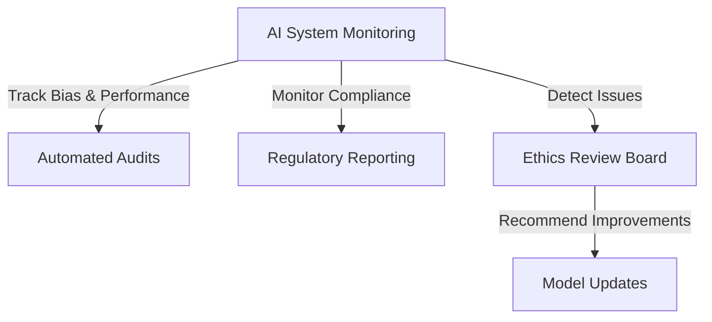

# AI Governance & Ethical Considerations Guide

## **1. Overview**
This guide outlines governance policies and ethical considerations for AI development and deployment within the **Iterative Refinement Engine**. Establishing clear guidelines ensures fairness, accountability, and compliance with global standards.

## **2. Objectives**
- Ensure **ethical AI usage** in decision-making processes.
- Implement **governance policies** for responsible AI development.
- Mitigate **bias and fairness concerns** in AI-generated outputs.
- Comply with **legal and regulatory frameworks** governing AI applications.

---

## **3. AI Governance Framework**

### **3.1 Governance Policies & Compliance**
- Adhere to **GDPR, CCPA, HIPAA, and SOC 2** compliance requirements, ensuring enforcement through regular audits, third-party reviews, and automated monitoring tools.
- Establish **AI model transparency** by documenting decision-making processes.
- Implement **audit trails** for AI-generated outputs to ensure accountability, including decision rationale, input-output pairs, and timestamps for traceability.

### **3.2 Risk Management & Accountability**
- Define **AI risk assessment criteria** to evaluate system vulnerabilities.
- Assign **human oversight roles** for critical decision-making processes.
- Develop **incident response protocols** for AI-related failures or ethical concerns, categorizing incidents by severity and defining clear escalation processes for resolution.

---

## **4. Ethical AI Principles**

### **4.1 Fairness & Bias Mitigation**
- Use **bias detection frameworks** (e.g., Fairlearn, AI Fairness 360) to identify potential biases, conducting assessments quarterly and applying corrective measures based on findings.
- Implement **algorithmic fairness techniques**, such as equalized odds and demographic parity.
- Conduct **regular audits** to assess and correct biases in model predictions.

### **4.2 Transparency & Explainability**
- Leverage **SHAP and LIME** for model interpretability.
- Provide **explanations for AI-driven decisions** to improve user trust.
- Maintain **open documentation** detailing model behavior and limitations, including decision logic, known biases, and mitigation strategies for full transparency.

---

## **5. Legal & Regulatory Compliance**

### **5.1 Data Privacy & Security**
- Encrypt sensitive data using **AES-256 and TLS 1.3**, ensuring encryption is applied both in transit and at rest for comprehensive security.
- Implement **role-based access controls (RBAC)** for AI model usage.
- Ensure **data retention policies** align with privacy regulations.

### **5.2 AI Model Auditing & Reporting**
- Establish **regular AI performance audits** to track compliance.
- Maintain **detailed logs** of AI interactions and decision rationales.
- Provide **compliance reports** to regulatory bodies as required, generating reports quarterly with detailed audit logs and adherence metrics.

---

## **6. Continuous Improvement & Monitoring**

### **6.1 AI System Monitoring**
- Use **automated monitoring tools** to track fairness and performance metrics.
- Establish an **Ethics Review Board** to oversee AI-related concerns, defining its structure with assigned roles, responsibilities, and a quarterly review schedule.
- Detect and address **anomalies in AI-generated content** proactively.

### **6.2 Responsible AI Development**
- Integrate **user feedback loops** to improve AI fairness and usability.
- Conduct **ongoing research** on ethical AI advancements.
- Update **AI policies and governance strategies** based on industry best practices, reviewing policies biannually and assigning responsibility to the AI Ethics Committee.
