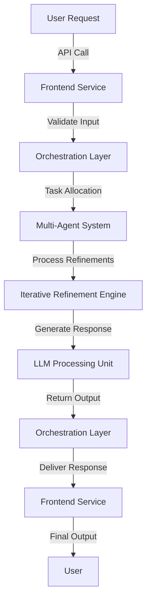
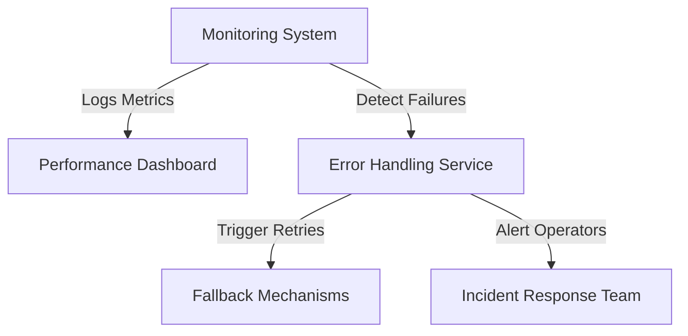

# End-to-End System Workflow Guide

## **1. Overview**
This guide provides a comprehensive **end-to-end workflow** for the **Iterative Refinement Engine**, detailing how different system components interact to process requests, refine outputs, and optimize performance.

## **2. System Architecture**
Below is a high-level overview of the system architecture and its major components.

## **3. Workflow Execution Steps**

### **3.1 Request Handling & Validation**
1. **User Request**: The system receives input from the user via the frontend API.
2. **Input Validation**: The frontend service ensures the request meets formatting and security requirements.
3. **Orchestration Layer**: The validated request is sent to the orchestration layer, which determines the processing flow, applying prioritization rules to manage concurrent requests efficiently.

### **3.2 Task Delegation & Processing**
1. **Task Allocation**: The **Orchestration Layer** assigns tasks to specialized AI agents.
2. **Multi-Agent Processing**: Agents handle different components of the task (e.g., data retrieval, summarization, validation), communicating through shared state management to coordinate workflows and share intermediate results.
3. **Iterative Refinement**: The **Iterative Refinement Engine** processes and refines intermediate outputs until the response reaches optimal quality.

### **3.3 LLM Processing & Response Generation**
1. **Refined Data Submission**: The processed request is sent to the **LLM Processing Unit**.
2. **Response Generation**: The model generates responses based on the refined input.
3. **Confidence Scoring & Adjustments**: The system evaluates the response confidence and applies adjustments if needed.

### **3.4 Response Delivery**
1. **Response Aggregation**: The final output is sent back through the **Orchestration Layer**.
2. **Frontend API Processing**: The response is formatted for user-friendly display.
3. **User Delivery**: The response is returned to the end-user.

## **4. Monitoring & Error Handling**

### **4.1 Performance Monitoring**
- Track **latency, processing times, and response quality**.
- Log **error rates, token consumption, and model drift metrics**.
- Use **automated anomaly detection** to flag irregular system behavior, leveraging statistical analysis and machine learning models to identify deviations from normal operation.

### **4.2 Error Recovery & Fault Tolerance**
- Implement **retry mechanisms with exponential backoff**, capping retries at a configurable limit and logging failures for debugging and performance analysis.
- Use **fallback models** when primary responses fail.
- Alert **incident response teams** for major failures, defined as sustained downtime exceeding 5 minutes or error rates above 10% for a given period.

## **5. Scalability & Optimization**
### **5.1 Dynamic Scaling**
- **Auto-scale** LLM instances based on request load.
- Implement **load balancing** to distribute agent workloads efficiently, utilizing weighted distribution and priority-based task assignment.
- Use **caching strategies** to minimize redundant queries, implementing in-memory caching (Redis) for frequently accessed data and distributed caching for large-scale workloads.

### **5.2 Continuous System Improvement**
- Track **user feedback** for refining AI agent workflows, collecting both explicit ratings and implicit behavior insights for adaptive model improvements.
- Conduct **periodic model retraining** to maintain accuracy, scheduled every six months or triggered by a 5% drop in accuracy metrics.
- Apply **A/B testing** for optimizing response generation techniques, defining test groups based on traffic segmentation and ensuring statistical significance using p-value analysis.
