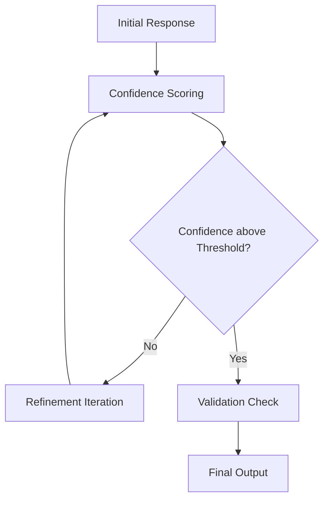

# Iterative Refinement Engine Implementation Guide

## **1. Overview**
The **Iterative Refinement Engine** is a core component of the Multi-Agent Pipeline, responsible for optimizing response generation through multiple iterations. It utilizes **latent space reasoning** and **adaptive feedback loops** to refine responses while maintaining token efficiency.

## **2. Objectives**
- Implement a **controlled feedback loop** for progressive response refinement.
- Utilize **confidence-based adjustments** to minimize unnecessary iterations.
- Optimize response accuracy without excessive token expansion.
- Enable **adaptive learning mechanisms** to improve refinement over time.

---

## **3. Core Refinement Mechanisms**

### **3.1 Latent Space Reasoning**
- Ensures modifications occur in an **intermediate representation** rather than directly altering token sequences. For example, instead of directly editing response text, the system refines underlying intent structures—such as entity relationships and contextual dependencies—before regenerating the final output.
- Prevents unnecessary token expansion by refining content **before** finalizing output.
- Allows the engine to **capture deeper contextual meaning** before generating a response.

### **3.2 Adaptive Feedback Loops**
- Adjusts refinement cycles based on **confidence scores**.
- Dynamically determines when a response has reached an acceptable quality level.
- Uses **historical performance data** to improve iteration efficiency over time.

### **3.3 Token Efficiency Strategies**
- Implements **truncation and prioritization** techniques to avoid exceeding token limits.
- Balances **detail retention** and **conciseness** for optimal response length.
- Uses **compression heuristics** to minimize computational overhead, applying methods like token clustering and redundancy filtering to maintain conciseness while preserving key information.

---

## **4. Implementation Strategy**

### **4.1 Refinement Execution Process**
```plaintext
Initial Response → Confidence Scoring → Refinement Iteration → Validation Check → Final Output
```


- The engine first generates an **initial response**.
- Confidence scoring evaluates the quality of the response based on predefined metrics such as coherence, factual accuracy, and relevance to the original query, with different weightings applied based on the query's complexity and domain. These weightings are dynamically adjusted using a combination of predefined rules, machine learning models, and user feedback.
- If confidence is below the **acceptable threshold**, the response undergoes additional **refinement iterations**.
- Once a response meets the confidence criteria, a **validation check** confirms its accuracy and completeness.
- The **final output** is then passed to the next stage in the pipeline.

### **4.2 Confidence Scoring & Thresholds**
- **Probability Distributions**: Uses AI-generated probability scores to measure response certainty.
- **Threshold Calibration**: Dynamically adjusts acceptable confidence levels based on prior iterations.
- **User Feedback Integration**: Collects explicit and implicit feedback to fine-tune scoring models.

### **4.3 Model Optimization & Learning**
- **Reinforcement Learning Mechanisms**: Uses prior successful refinements to improve future iterations.
- **Error Detection & Correction**: Identifies inconsistencies and adapts responses accordingly.
- **Performance Logging & Analysis**: Tracks efficiency and effectiveness of refinement cycles.

---

## **5. Integration with Multi-Agent Pipeline**
- The engine operates between **each agent iteration**, ensuring **continuous improvement**.
- Communicates asynchronously through **Azure Service Bus** for distributed processing, chosen for its robust queueing capabilities and ability to handle high-throughput workloads compared to alternatives like Event Grid or Kafka.
- Stores **stateful refinement data** to avoid redundant computations across iterations.

---
