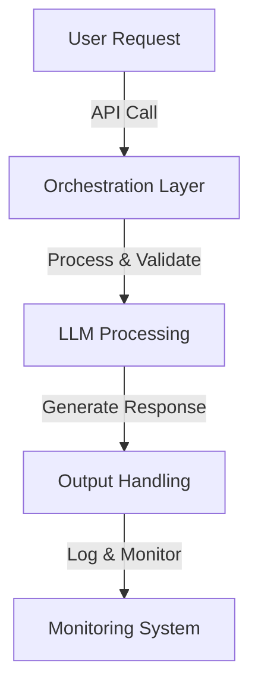
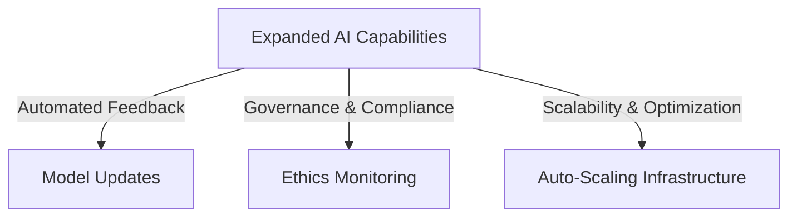

# Minimum Viable Product (MVP) Implementation Plan

## **1. Overview**
This document outlines the phased approach for implementing the **Iterative Refinement Engine**, starting with a **Minimum Viable Product (MVP)** to establish core functionalities before expanding to full capabilities. The MVP ensures a functional, scalable foundation while allowing incremental improvements based on user feedback and system performance.

## **2. Objectives**
- Deploy a **baseline system** with essential features.
- Establish a **scalable architecture** that allows for future enhancements.
- Prioritize **core AI processing and response generation**.
- Implement **basic monitoring, security, and governance**.

---

## **3. MVP Scope & Features**

### **3.1 Core Components**
- **User Input Processing**: API for handling and validating user requests.
- **LLM Integration**: Basic model interface for generating responses.
- **Orchestration Layer**: Manages request flow and assigns tasks to agents.
- **Logging & Monitoring**: Tracks system performance and failures.

### **3.2 Initial AI Capabilities**
- **Response Generation**: LLM-based answer generation.
- **Basic Refinement Loop**: Iterative adjustments for response accuracy.
- **Confidence Scoring**: Assessing output reliability.

### **3.3 Security & Compliance**
- **Basic Role-Based Access Control (RBAC)**.
- **Data Encryption (AES-256, TLS 1.3)**.
- **Logging for auditability**.

---

## **4. Phase 1: MVP Deployment**

### **4.1 Deployment Steps**
1. **Set up cloud infrastructure** (e.g., Azure AI, Kubernetes, or serverless functions).
2. **Deploy core services** (API Gateway, Orchestration Layer, LLM Engine).
3. **Implement logging & basic monitoring**.
4. **Conduct initial user testing & validation**.

---

## **5. Phase 2: Enhanced AI Capabilities**

### **5.1 Refinement & Expansion**
- **Multi-Agent Collaboration**: Enable specialized agents for different tasks.
- **Improved Context Handling**: Store interaction history for better responses.
- **Bias Detection & Mitigation**: Introduce fairness checks in AI outputs.

### **5.2 Performance Optimization**
- **Caching Strategies** to reduce redundant processing.
- **Parallel Processing** for high-throughput AI tasks.
- **Adaptive Scaling** based on request load.

---

## **6. Phase 3: Full-Scale Deployment**

### **6.1 Advanced Features**
- **Automated Feedback Integration** for continuous model improvement.
- **Advanced Explainability**: SHAP/LIME-based interpretability tools.
- **Ethical AI Governance**: Comprehensive audit trails & bias reporting.

### **6.2 System Hardening & Security**
- **Full Compliance Enforcement** (GDPR, CCPA, HIPAA).
- **Fine-Grained Access Controls & Role Management**.
- **Automated Incident Response & Recovery**.

## **7. Conclusion**
This phased implementation ensures a **stable, scalable, and adaptable AI system**, starting with a functional MVP and progressively adding advanced features. Each phase builds on the prior, incorporating user feedback, performance insights, and regulatory requirements to create a **fully optimized AI-powered system**.
