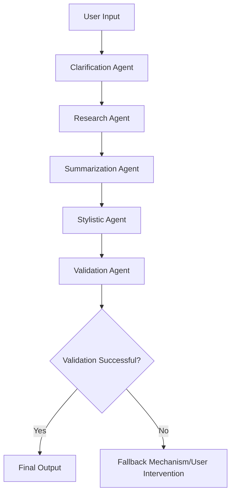

# Multi-Agent Pipeline Implementation Guide

## **1. Overview**
This guide details the implementation of the **Multi-Agent Pipeline** within the Azure AI Foundry environment. The pipeline enables an iterative, multi-stage refinement process where different AI agents collaborate to improve response quality efficiently.

## **2. Objectives**
- Define the **roles** of each agent in the refinement process. Roles can be dynamically assigned based on the complexity and nature of the user query. If a role assignment fails, a fallback mechanism reassigns tasks to the nearest matching agent based on predefined logic, such as role similarity scoring or historical task success rates. For example, if a Research Agent fails to retrieve relevant information, a Summarization Agent may be tasked with reformatting the available data instead.
- Establish **communication protocols** between agents.
- Implement **task execution flow** with iterative processing.
- Ensure **token efficiency** while maintaining response accuracy.

---

## **3. Agent Roles & Responsibilities**

### **3.1 Clarification Agent**
- Purpose: Refines the user input to ensure clarity and completeness.
- Tasks:
- Detects ambiguities or missing details.
- Suggests refinements to improve query specificity.
- Rewrites input while preserving intent.

### **3.2 Research Agent**
- Purpose: Gathers factual information to support response generation.
- Tasks:
- Identifies knowledge gaps.
- Queries external knowledge bases or APIs.
- Structures data for further processing.

### **3.3 Summarization Agent**
- Purpose: Condenses responses while preserving key information.
- Tasks:
- Eliminates redundancy.
- Reformulates content into concise formats.
- Ensures coherence and readability.

### **3.4 Stylistic Agent**
- Purpose: Adjusts response tone and structure to match user preferences.
- Tasks:
- Enhances readability and engagement.
- Aligns response style with intended use case (formal, casual, technical, etc.).
- Ensures consistency across iterative refinements.

### **3.5 Validation Agent**
- Purpose: Ensures final response accuracy and logical consistency.
- Tasks:
- Detects factual inconsistencies or errors.
- Verifies coherence across all refinements.
- Confirms adherence to user constraints and preferences.

---

## **4. Agent Communication & Workflow**
### **4.1 Shared State Management**
- All agents operate on a **shared latent representation** of responses.
- Each agent modifies the shared state rather than appending additional tokens.
- Changes are validated before passing to the next agent.

### **4.2 Execution Flow**
```plaintext
User Input → Clarification Agent → Research Agent → Summarization Agent →
Stylistic Agent → Validation Agent → Validation Successful? → Yes → Final Output
                                                               No → Fallback Mechanism/User Intervention
```


### **4.3 Inter-Agent Messaging**
- Agents communicate asynchronously through an **Azure Service Bus**, chosen for its reliability and ability to handle large-scale distributed messaging compared to options like Event Grid or Kafka.
- Each agent listens for updates, processes data, and forwards results to the next stage.
- Errors trigger fallback mechanisms or prompt user intervention.

---

## **5. Implementation Strategy**

### **5.1 Setting Up the Pipeline in Azure AI Foundry**
- Deploy **Azure AI Services** for each agent.
- Configure **Azure Service Bus** for inter-agent messaging.
- Define **scaling rules** to optimize performance.

### **5.2 Agent Execution Mechanism**
- Use **Azure Functions** for lightweight, event-driven execution or **Azure Kubernetes Service (AKS)** for more complex, scalable workloads that require persistent processing.
- Implement **task queuing** for efficient processing.
- Monitor execution using **Azure Application Insights**, Tracking metrics such as execution latency, agent response quality, and failure rates to ensure optimal performance. For example, if response quality degrades over multiple iterations, adjustments can be made dynamically through predefined thresholds or machine learning-based adaptation to optimize prioritization logic and token usage limits. These adjustments are logged and visualized through a monitoring dashboard using tools such as Azure Monitor and Grafana to provide transparency and debugging insights.

### **5.3 Iterative Refinement & Token Efficiency**
- Enforce **token-aware processing** to avoid unnecessary context expansion.
- Limit processing cycles to maintain API cost-effectiveness.
- Use **adaptive feedback loops** based on response confidence scores.

---
